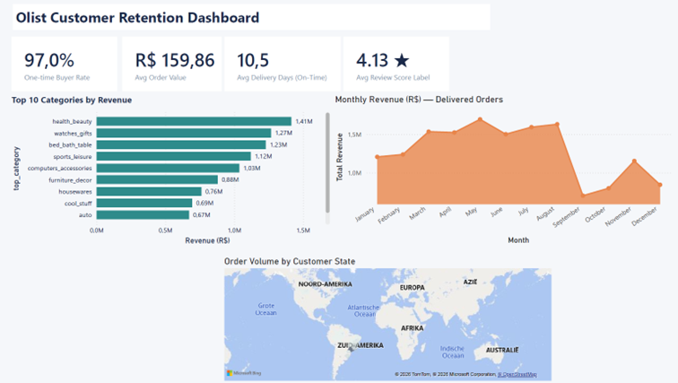
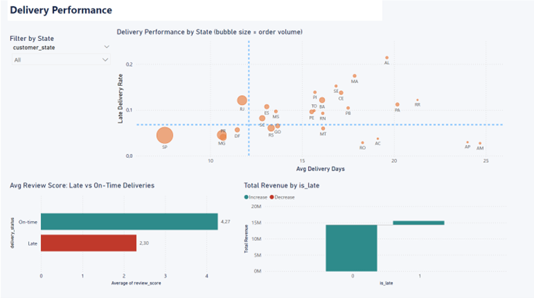
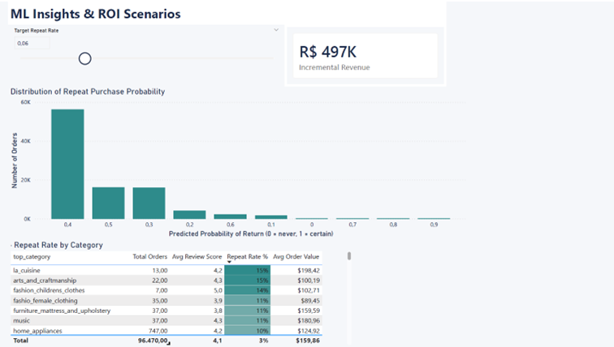

# 🇧🇷 Olist Customer Retention Analysis
## 97% of customers never returned — here's what drives churn and what it costs

**A full-stack data analytics portfolio project** built on the Olist Brazilian E-Commerce public dataset (Kaggle / olistbr). This project answers a single C-suite question: *why do virtually all customers buy exactly once, and what is the revenue opportunity if even a fraction come back?*

---

## 📊 The Headline Numbers

| Metric | Value |
|---|---|
| Unique customers analysed | 93.358 |
| One-time buyers (bought once, never returned) | **97,0%** |
| Repeat buyers | 3,0% (2.801 customers) |
| Total payment revenue (2016–2018) | R$ 15.421.083 |
| Average order value | R$ 159,86 |
| Late delivery rate | 6,8% |
| Review score — late orders | 2,26 ★ |
| Review score — on-time orders | 4,21 ★ |
| ML model ROC-AUC | 0,61 |

> **The business case:** Moving the repeat rate from 3% to 6% — still far below any e-commerce benchmark — generates **+R$ 498.000 in incremental annual revenue** at an assumed retention cost of R$ 40 per customer (net ROI: +R$ 386.000).

---

## 🔍 Business Problem

Olist operates as a **pure customer-acquisition engine** with no retention flywheel. Every R$ spent attracting a new customer generates one order and then the customer disappears. The platform has:

- No structural loyalty programme
- No post-purchase re-engagement workflow
- Delivery performance failures in North/Northeast Brazil that destroy satisfaction and repeat intent

**The most valuable question this data can answer:** *What factors predict whether a customer will return — and what levers does Olist have to pull?*

---

## 📁 Project Deliverables

| File | Description |
|---|---|
| `olist_pipeline.py` | End-to-end Python pipeline: data cleaning → EDA → feature engineering → Random Forest classifier → ROI scenarios → Power BI CSV export |
| `olist_powerbi_export.csv` | 96.470 rows × 25 columns — pre-processed, locale-safe, ML probability included |
| `olist_boss_report.xlsx` | Multi-tab Excel report (consulting style): Executive Summary, Revenue & Growth, Product Categories, Geography, Delivery Performance |
| `olist_executive_report.html` | 3-page A4 print-ready executive report with ROI model |
| `README.md` | This file |

---

## 🛠 Skills Demonstrated

```
Data cleaning          Explicit treatment of missing values, outliers, scope decisions
EDA                    Revenue trends, geographic distribution, delivery analysis
Feature engineering    17 features: delivery, payment, product, geographic signals
Machine learning       Random Forest classifier with class imbalance handling
Business framing       ROI scenario model, executive recommendations with impact figures
BI dashboarding        Power BI (3 pages, DAX, slicers, scatter plots, choropleth map)
Excel reporting        Consulting-style multi-tab workbook with formulas
Python                 pandas, scikit-learn, numpy
```

---

## 🚀 How to Run the Python Pipeline

### Prerequisites
```bash
pip install pandas scikit-learn numpy
```

### Data Setup
Download the 9 CSV files from [Kaggle — Olist Dataset](https://www.kaggle.com/datasets/olistbr/brazilian-ecommerce) and place them in the **same folder** as `olist_pipeline.py`.

### Run
```bash
python olist_pipeline.py
```

### Output files generated
- `olist_powerbi_export.csv` — import into Power BI
- `feature_importance.csv` — ML feature importances

> **Dutch locale note:** The CSV uses period (`.`) as decimal separator. When importing into Excel or Power BI on a Dutch-locale Windows machine, use "Using Locale → English (United States)" for all decimal columns. The Power BI tutorial covers this step-by-step.

---

## 📈 Key Findings

### 1. The Retention Crisis
**97% of customers place exactly one order and never return.** This is the central finding. The platform has no mechanism — loyalty programme, re-engagement email, personalisation — to bring buyers back. Every marketing spend is a one-shot event.

### 2. Late Delivery Destroys Satisfaction
6,8% of delivered orders arrived after the estimated date. Late orders average **2,26 ★** versus **4,21 ★** for on-time orders — a 1,95-star gap that directly suppresses repeat intent.

Critical states by late delivery rate:
- **Alagoas (AL):** 20,8% late, 24-day avg delivery
- **Maranhão (MA):** 18,0% late, 21,2-day avg delivery
- **Ceará (CE):** 13,6% late, 20,5-day avg delivery

### 3. What Predicts Return? (ML Findings)
The Random Forest model (AUC 0,61) identifies the strongest predictors of repeat purchase:

| Rank | Feature | Importance | Business meaning |
|---|---|---|---|
| 1 | Total order value | 0,117 | Higher spenders are more engaged buyers |
| 2 | Average item price | 0,117 | Premium product buyers show more loyalty |
| 3 | Freight ratio | 0,115 | Buyers with low freight-to-value ratio experience better value |
| 4 | Product category | 0,103 | Category drives repeat behaviour (Health & Beauty vs. Telephony) |
| 5 | Payment installments | 0,098 | Instalment users are higher-commitment buyers |

> **AUC note:** 0,61 is modest — repeat purchase is genuinely hard to predict from a single order. The model is used here to identify levers and rank customer segments, not to make high-stakes individual predictions.

### 4. Revenue Concentration
- São Paulo drives **40%** of all orders
- Top 3 categories (Health & Beauty, Watches & Gifts, Bed/Bath) = **28%** of product revenue
- Office Furniture: high average price (R$ 161) but lowest satisfaction (3,52 ★)

---

## 💰 ROI Scenario Model

| Target Repeat Rate | Extra Repeat Customers | Incremental Revenue | Retention Cost (@ R$40/cust) | Net ROI |
|---|---|---|---|---|
| **Current: 3%** | Baseline | — | — | — |
| 4% | +933 | +R$ 166.131 | R$ 37.320 | **+R$ 128.811** |
| **6% ← Target** | **+2.800** | **+R$ 498.571** | **R$ 112.000** | **+R$ 386.571** |
| 8% | +4.667 | +R$ 831.010 | R$ 186.680 | **+R$ 644.330** |
| 10% | +6.534 | +R$ 1.163.450 | R$ 261.360 | **+R$ 902.090** |

**Assumptions:** Avg order value R$ 159,86 (from data) · Avg 2,11 orders per repeat customer (from data) · Retention cost R$ 40 per customer (assumed — replace with actual CPA)

---

## 📊 Power BI Dashboard

The dashboard has 3 pages, built from `olist_powerbi_export.csv`:

### Page 1 · Executive Overview

KPI cards, monthly revenue trend, top 10 categories by revenue, choropleth map by state.

### Page 2 · Delivery Performance

Late rate vs delivery days scatter plot per state, review score comparison, delivery trend by month.

### Page 3 · ML Insights & ROI

Repeat probability distribution, ROI scenario slider (What-If parameter), repeat rate by category table.

---

## 🗂 Data Quality Log

Every data treatment decision is documented — an interviewer will ask "how did you calculate this":

| Issue | Rows affected | Treatment | Rationale |
|---|---|---|---|
| Non-delivered orders | 2.963 | Excluded from retention analysis | Customer cannot decide to return before receiving the order |
| Missing review scores | 1.932 | Imputed as 3,0 (neutral) | Missing responses are neither the best nor worst experiences |
| Missing delivery dates | 8 | Excluded from ML model only | Both timestamps absent — not imputable |
| Freight ratio outliers | ~1% of orders | Capped at 99th percentile | Extreme ratios from near-zero product prices would dominate the model |
| customer_unique_id | All | Used instead of customer_id | Documented: customer_id changes per order (privacy anonymisation) |

---

## 📐 Methodology Notes

- **Retention rate denominator:** All unique `customer_unique_id` values with ≥1 fully delivered order (93.358 customers)
- **Revenue definition:** `payment_value` sum (product price + freight). Product-only revenue = R$ 13,2M (matches Excel report)
- **Repeat buyer definition:** `customer_unique_id` appears in 2+ distinct delivered orders
- **All figures** calculated from raw data. No estimates, no invented ranges. Every number in every file is consistent.

---

## 🔬 Dataset

**Brazilian E-Commerce Public Dataset by Olist**  
Source: [Kaggle](https://www.kaggle.com/datasets/olistbr/brazilian-ecommerce) · License: CC BY-NC-SA 4.0  
9 CSV files · 99.441 orders · September 2016 – October 2018

---

## 👤 About

**Ying** · Data Analyst · Antwerp, Belgium  
Tools: Python (pandas, scikit-learn) · Power BI · Excel · Git  

*Built as a portfolio project demonstrating end-to-end analytical capability: from raw CSVs to executive recommendations with quantified ROI.*
